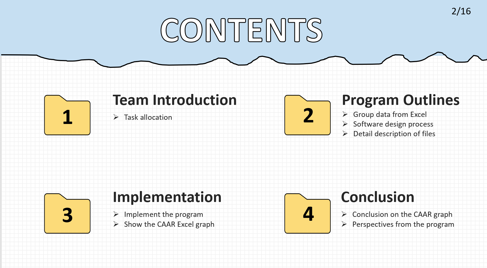
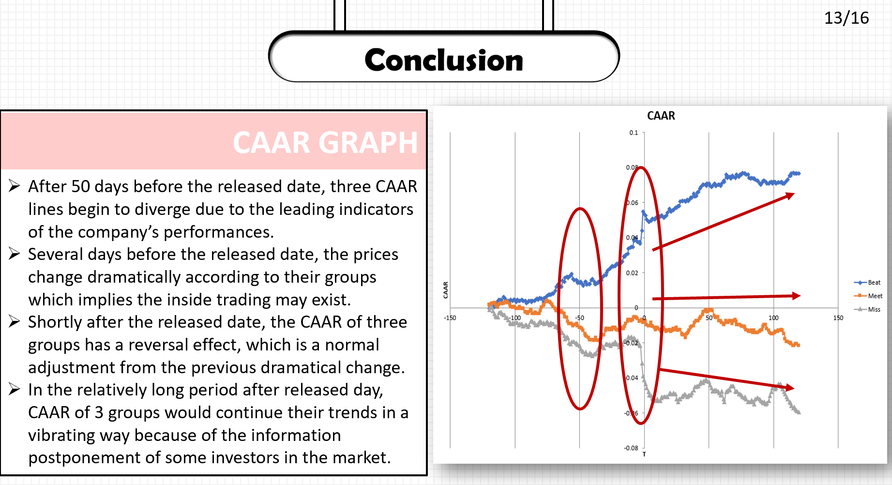
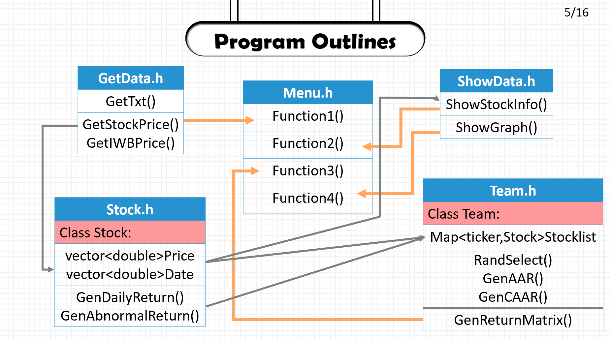
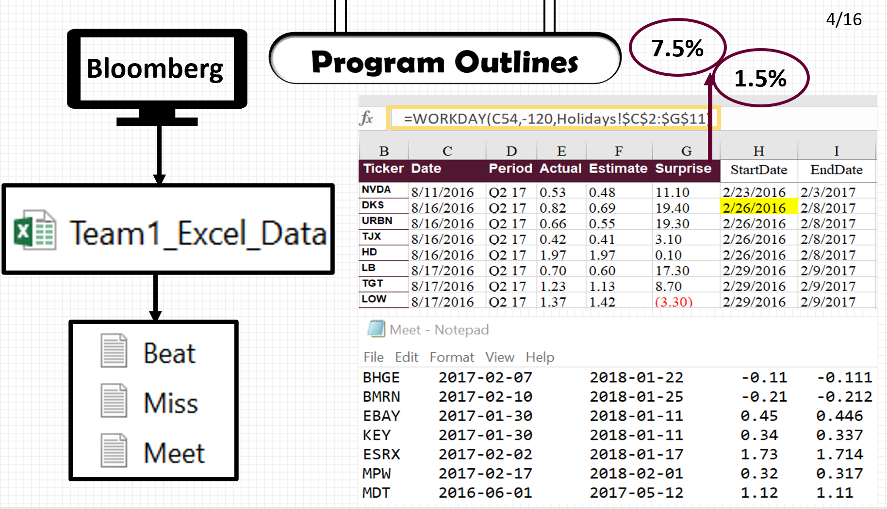
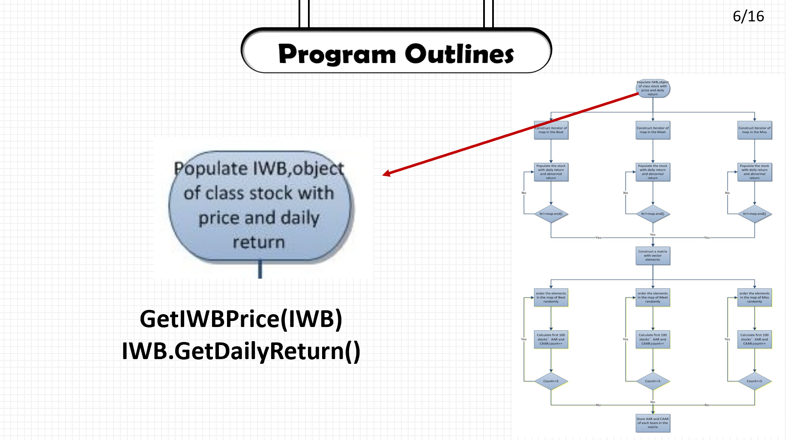
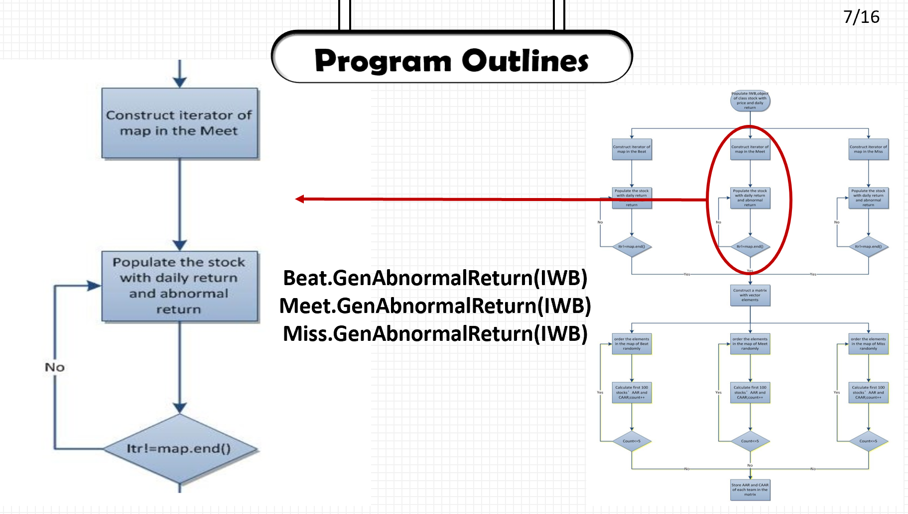
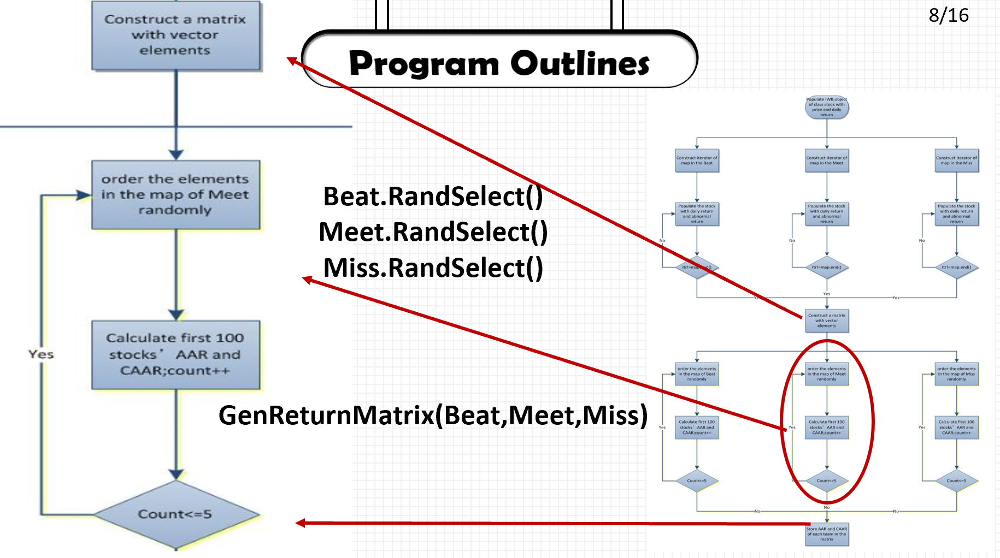
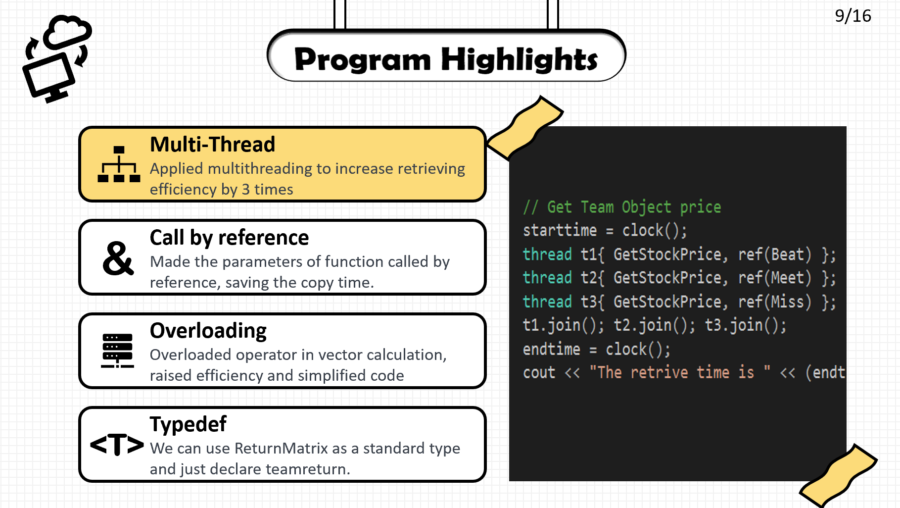

# Stock-Price-Shock-By-Earning-Release
Analyzed the earning events (EPS surprise) effect on stock prices, with stock prices data scraped from Yahoo finance. This is my C++ final projects working in a Team of 5.

## Framework

## Conclusion 

## Program Outline 

## Highlights 

